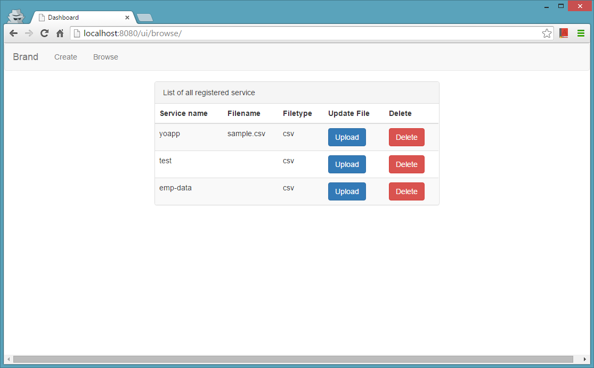
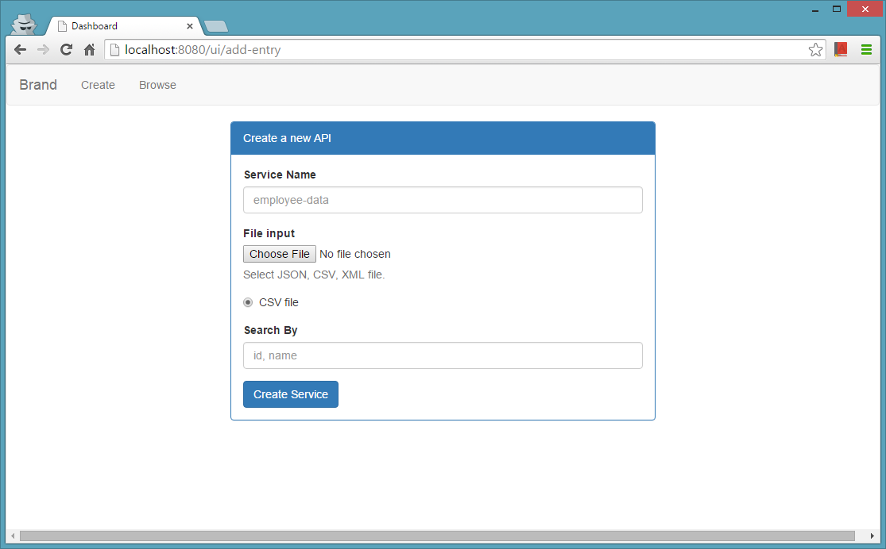
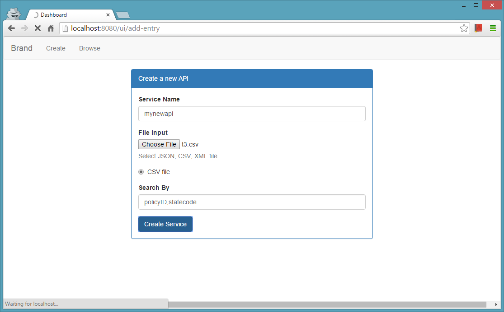
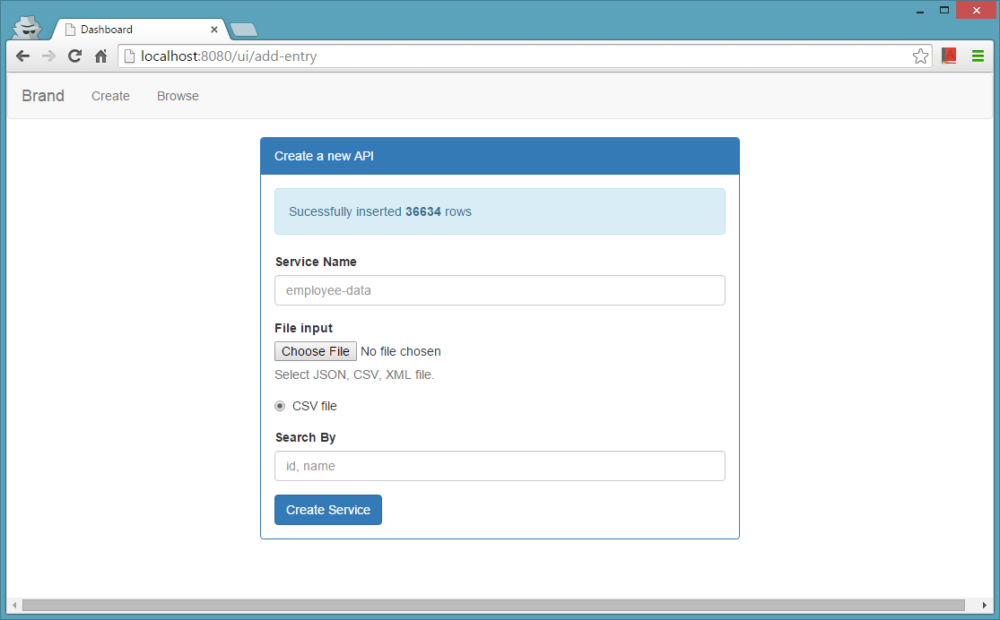
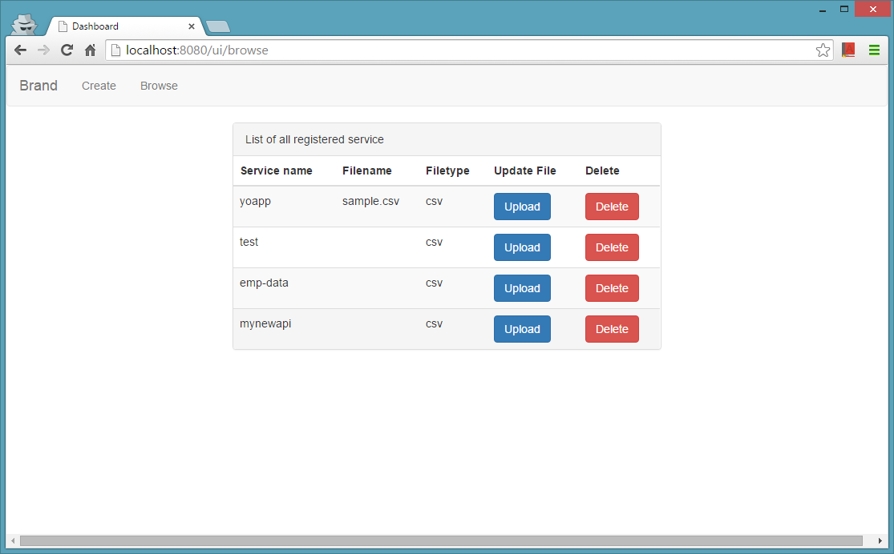
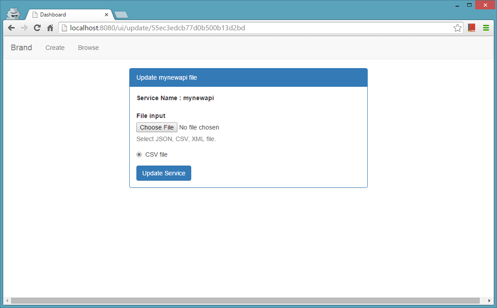
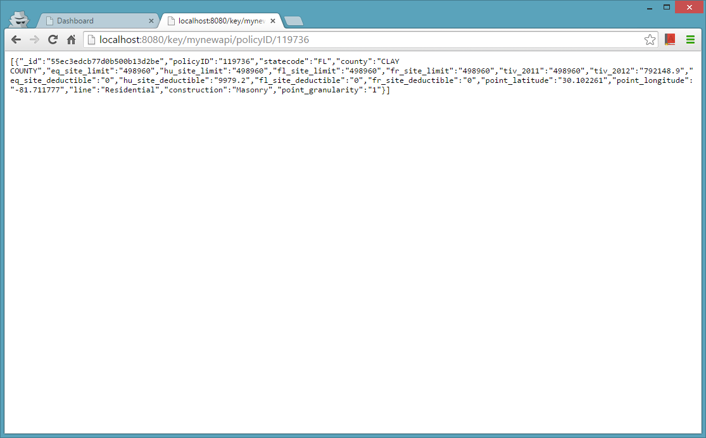

# CSV to REST API

It is a simple tool for someone who just quickly want to convert a CSV file to REST API for testing or what ever reason. Not for production use but you want you can it not that buggy

It is built on top Node.js with express I would not go into to much detail in this file it is for quick start.

#### Requirement
- node.js [Download Link](https://nodejs.org/en/)
- mongoDB [Download Link](https://www.mongodb.org/downloads#production)

#### Installing
- Download this project as Zip
- Open `cmd` in this folder
- type `npm install`
- and then `npm start`
- now you are ready
- goto [Goto Link](http://localhost:5000/ui)

### How to Upload File
- goto [link](http://localhost:5000/ui/add-entry)
- Now Choose a CSV file to Upload
- give it a name in Service Name (like employee-record)
- Enter column name you want to search (like name,city)
- Hit Create service
- Thats All

#### How to access service
Url to access you File content is

localhost:5000/api/**service_name**/**key**/**value**

here service_name is name you enter while creating service
key is column name and key is value to search for

for example you have CSV file which looks like

| Name          | Movie             |
| ------------- |:-----------------:|
| Colter Stevens| Source code       |
| Christina Warren| Source code     |
| Neo           | Matrix            |
| Morpheus      | Matrix            |
| Rey           | Star Wars         |
| Luke Skywalker| Star Wars         |

you uploaded it with service name `casts`

now if you want to find name of all character worked in Matrix

then link will be like
`localhost:5000/api/casts/Movie/Matrix`
you can add multiple key value like
`localhost:5000/api/casts/Movie/Matrix/Name/Neo`

#### Images

#### Bugs or Feedback
feel free to share.
